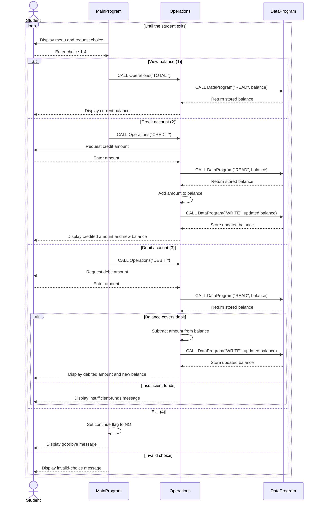

# COBOL Student Account System

This directory documents the COBOL account-management example in `src/cobol`. The program provides a simple interactive interface for viewing and updating a student's account balance.

## Source Files

### `src/cobol/main.cob`

`MainProgram` is the user-facing entry point. It displays the account-management menu, accepts a numeric choice, and dispatches the selected action to `Operations`.

Key responsibilities:

- Display the options to view the balance, credit the account, debit the account, or exit.
- Accept choices `1` through `4`.
- Call `Operations` with the corresponding six-character operation code:
  - `TOTAL ` for viewing the balance.
  - `CREDIT` for adding funds.
  - `DEBIT ` for removing funds.
- Display an error for any choice outside the supported menu options.
- Continue prompting until the user selects exit.

### `src/cobol/operations.cob`

`Operations` implements the account actions requested by the main program. It receives an operation code through its linkage section and coordinates all balance reads and writes through `DataProgram`.

Key functions:

- **Total:** Read and display the current balance.
- **Credit:** Accept an amount, read the current balance, add the amount, save the updated balance, and display the result.
- **Debit:** Accept an amount, read the current balance, and subtract the amount only when sufficient funds are available.

### `src/cobol/data.cob`

`DataProgram` is the balance data-access routine. It owns the stored balance and exposes a small read/write interface through its linkage section.

Key functions:

- **`READ`:** Copy the stored balance into the balance value supplied by the caller.
- **`WRITE`:** Replace the stored balance with the caller's value.

The balance is held in working storage, so it is available only for the lifetime of the running program. There is no file or database persistence in the current implementation.

## Student Account Business Rules

- A new account starts with a balance of `1000.00`.
- A balance inquiry does not change the account balance.
- Credits increase the current balance by the entered amount and are saved immediately.
- Debits decrease the current balance only when `current balance >= debit amount`.
- A debit that exceeds the current balance is rejected and displays `Insufficient funds for this debit.` The stored balance remains unchanged.
- The account balance uses two decimal places and supports values up to `999999.99` based on the COBOL picture `9(6)V99`.
- The current code does not explicitly reject zero, negative, or over-range input amounts. Input validation should be added before treating those cases as valid student-account transactions.
- Operation codes are six-character values. `TOTAL ` and `DEBIT ` include a trailing space to match the declared field width.

## Runtime Flow

```text
MainProgram
    -> Operations (TOTAL / CREDIT / DEBIT)
        -> DataProgram (READ)
        -> DataProgram (WRITE, for successful credits and debits)
```

The program exits when the user selects option `4`.

## Application Data Flow


